# 20 项系数的光斑变化趋势

这些图直接调用项目的 `simulate()` 生成，不是手绘示意。每一行只改变一个系数，其余 19 项保持为零；从左到右为 **−120、−60、0、+60、+120 meV**。中间的 `0 meV` 是无残余像差时的直线基线。

为方便比较形状，所有图固定使用能量视野 `±180 meV`、纵向视野 `v ∈ [−1.6, 1.6]`、同一采样种子和 `γ=0.5`。每一格像界面默认模式一样独立自动亮度，因此图中亮度不能用来比较不同系数值的峰值强弱。横轴是能量 `E`，纵轴是归一化角坐标 `v`。

公式约定为 `E = Σ Dij uⁱvʲ + ε`，没有阶乘。这里展示的是离线合成教学模型，不是实际仪器标定。对称孔径会让部分正负系数只表现为左右镜像，某些仅含 `u` 奇次幂的项甚至具有相同的图像分布。

## 一阶

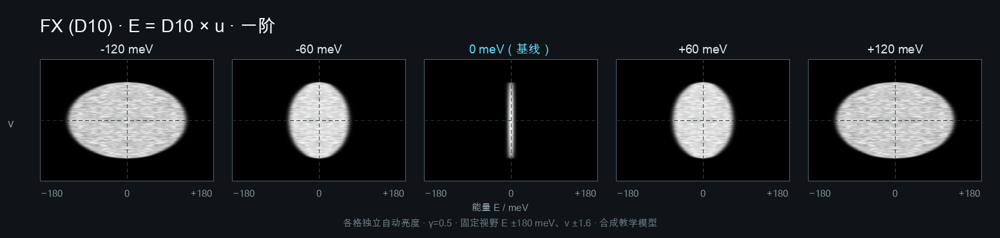

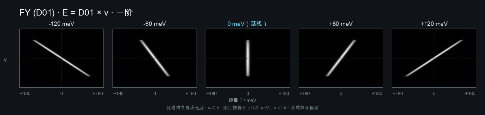

## 二阶

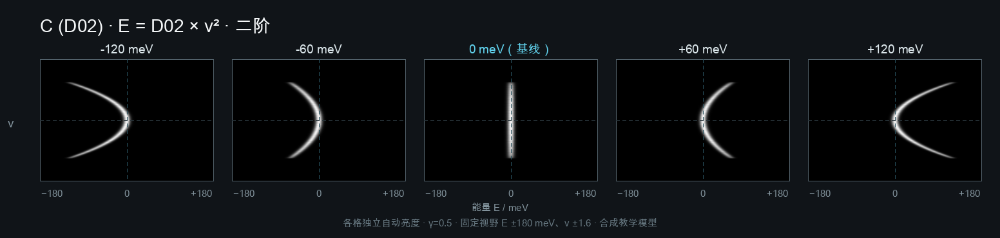

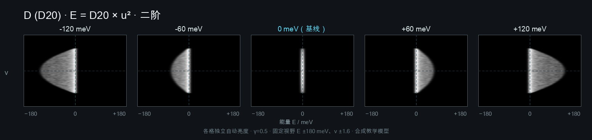

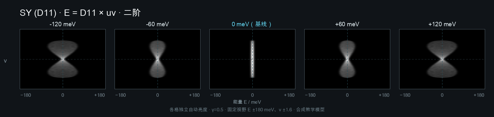

## 三阶

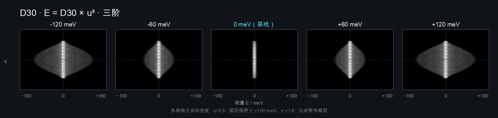

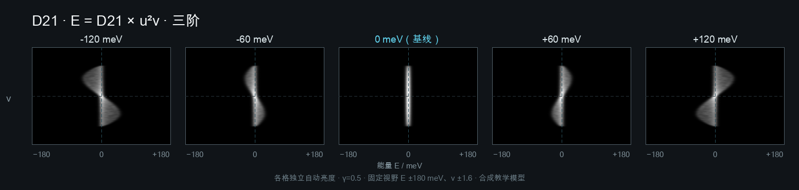

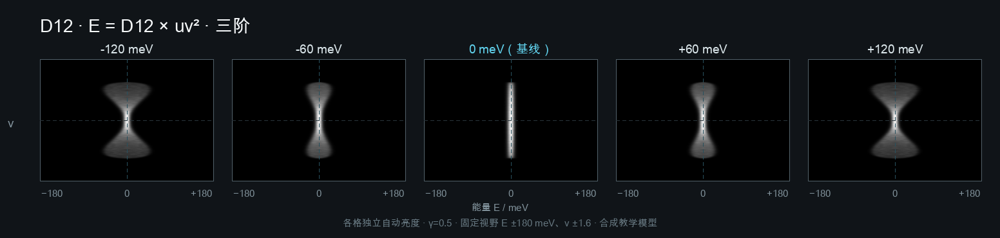


## 四阶

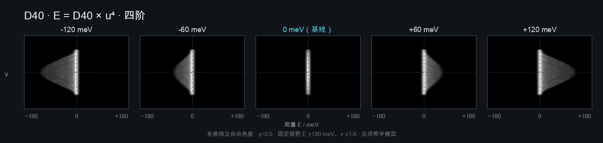


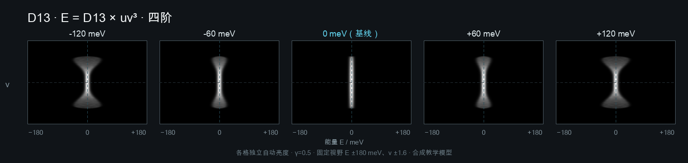

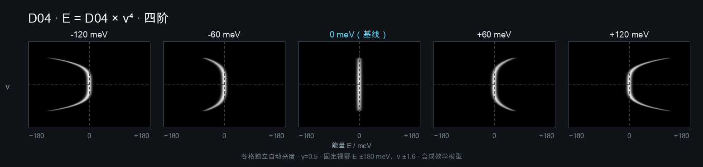

## 五阶

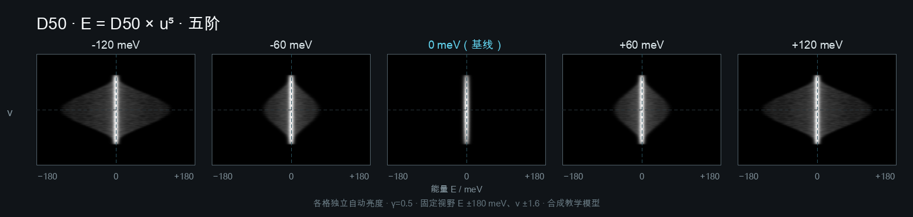

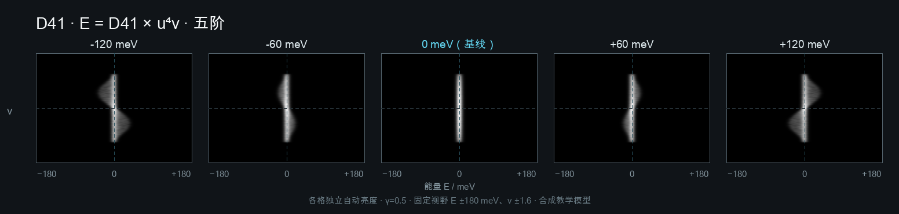

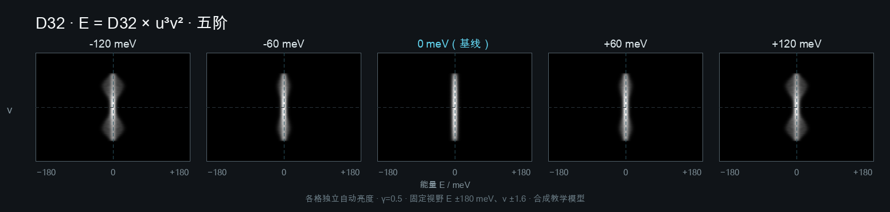


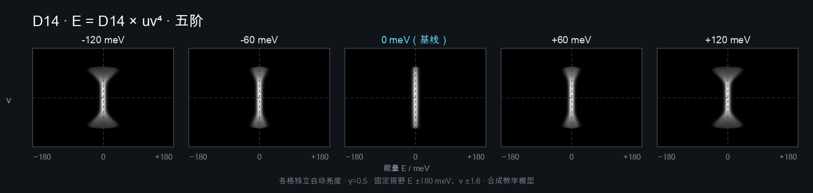

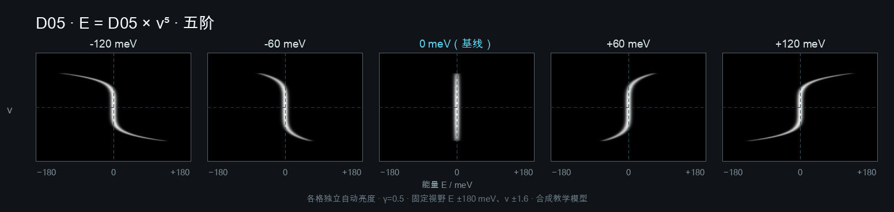

## 重新生成

在已安装运行依赖的环境中执行：

```bash
PYTHONPATH=src python3 tools/generate_coefficient_trends.py
```

生成器只写入 `docs/assets/coefficient-trends/`，不会连接仪器或修改练习数据。
